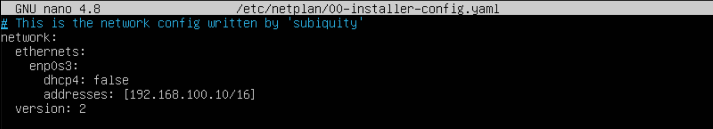
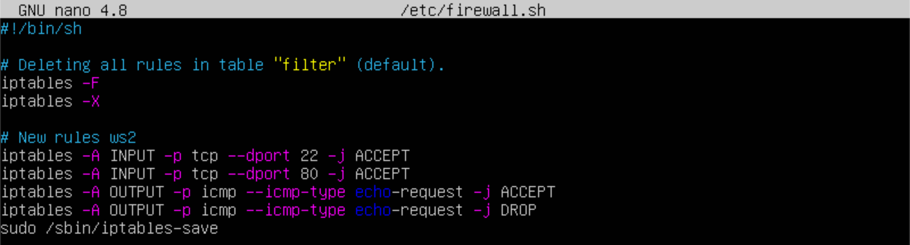
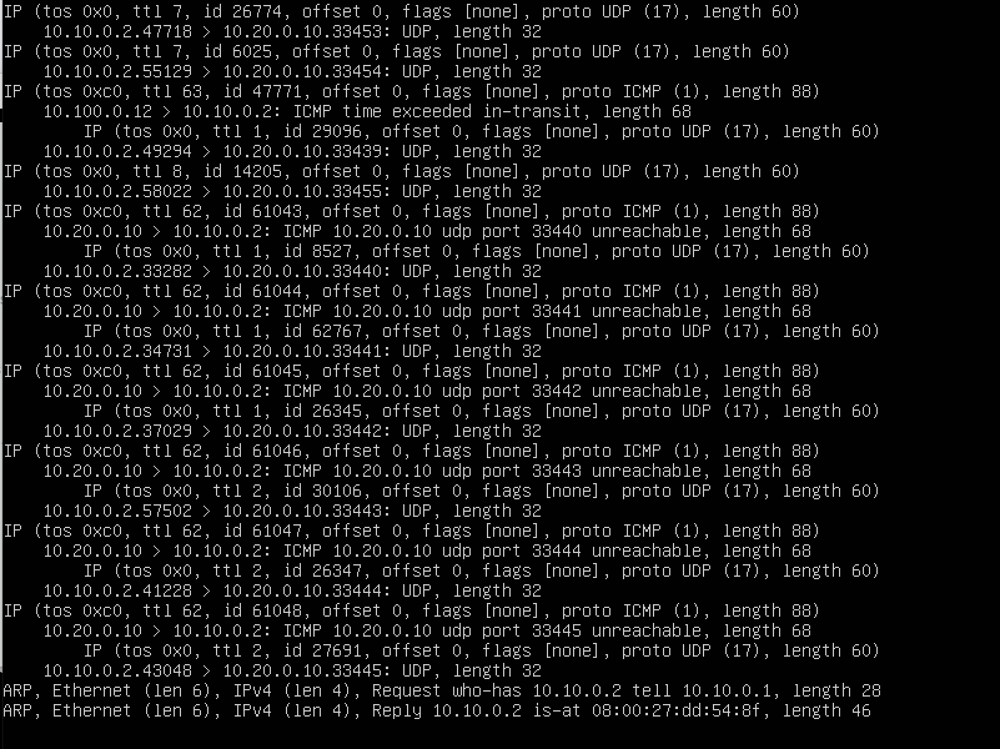
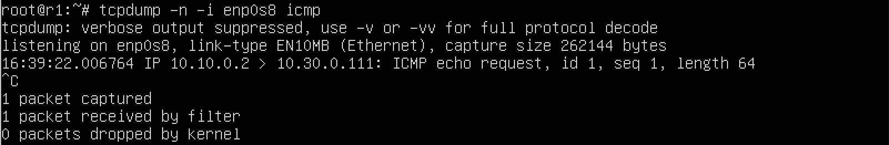

# Сети в Linux

## Part 1. Инструмент **ipcalc**

> ipcalc предоставляет простой метод для вычисления IP-информации хоста.

1. Для начала устанавливаю утилиту ipcalc, командой `sudo apt install ipcalc`

##### Поднятие виртуальной машины (далее -- ws1)

#### 1.1. Сети и маски

##### 1) Адрес сети *192.167.38.54/13*

2. Узнал адрес сети командой `ipcalc 192.167.38.54/13`

Адрес сети: **192.160.0.0/13**

##### 2) Перевод маски *255.255.255.0* в префиксную и двоичную запись, */15* в обычную и двоичную, *11111111.11111111.11111111.11110000* в обычную и префиксную

3. Перевел маску командой `ipcalc 255.255.255.0`

В двоичную запись - **11111111.11111111.11111111.00000000**
В префиксную запись - **/24**

4. Перевел префикс маски командой `ipcalc 255.255.255.0`

В обычную - **255.254.0.0**
В двоичную - **11111111.11111110.00000000.00000000**

5. Перевел двоичную запись маски

В обычную - **255.255.255.240**
В префискную - **/28**

##### 3) Минимальный и максимальный хост в сети *12.167.38.4* при масках: */8*, *11111111.11111111.00000000.00000000*, *255.255.254.0* и */4*

6. Определил минимальный и максимальный хост в сети *12.167.38.4* при масках:

1) /8 - мин: **12.0.0.1**, макс: **12.255.255.254**
2) 11111111.11111111.00000000.00000000 - мин: **12.167.0.1** , макс: **12.167.255.254**
3) 255.255.254.0 - мин: **12.167.38.1**, макс: **12.167.39.254**
4) /4 - мин: **0.0.0.1**, макс: **15.255.255.254**

#### 1.2. localhost
##### Определение и запись в отчёт, можно ли обратиться к приложению, работающему на localhost, со следующими IP: *194.34.23.100*, *127.0.0.2*, *127.1.0.1*, *128.0.0.1*

7. Командой `ipcalc 127.0.0.1 127.255.255.254 | grep` + `данные IP` вывел все адреса в заданном промежутке и с помощью `grep` проверил вхождение искомых IP в заданный диапазон.

Можно обратиться: 127.0.0.2, 127.1.0.1
Нельзя обратиться: 194.34.23.100, 128.0.0.1

#### 1.3. Диапазоны и сегменты сетей

##### 1) Какие из перечисленных IP можно использовать в качестве публичного, а какие только в качестве частных: *10.0.0.45*, *134.43.0.2*, *192.168.4.2*, *172.20.250.4*, *172.0.2.1*, *192.172.0.1*, *172.68.0.2*, *172.16.255.255*, *10.10.10.10*, *192.169.168.1*

8. Командой `ipcalc` + `данный IP` определил частный IP или публичный. Другой способ - проанализировать диапозоны частных IP.

Публичные: 134.43.0.2, 172.0.2.1, 192.172.0.1, 172.68.0.2, 192.169.168.1
Частыне: 10.0.0.45, 192.168.4.2, 172.20.250.4, 172.16.255.255, 10.10.10.10

##### 2) Какие из перечисленных IP адресов шлюза возможны у сети *10.10.0.0/18*: *10.0.0.1*, *10.10.0.2*, *10.10.10.10*, *10.10.100.1*, *10.10.1.255*

9. Командой `ipcalc 10.10.0.0/18` определил min и max host в сети 10.10.0.0/18. Далее проверил вхождение в диапазон 10.10.0.1 - 10.10.63.254.

Возможно: 10.10.0.2, 10.10.10.10, 10.10.1.255
Невозможно: 10.0.0.1, 10.10.100.1

## Part 2. Статическая маршрутизация между двумя машинами

##### С помощью команды `ip a` просмотр существующих сетевых интерфейсов

1. Вывел сетевые интерфейсы для обеих машин

##### Описание сетевого интерфейса, соответствующего внутренней сети, на обеих машинах и задание следующих адресов и масок: ws1 - *192.168.100.10*, маска */16*, ws2 - *172.24.116.8*, маска */12*.

2. Описал сетевой интерфейс на обоих виртуальных машинах.

Сетевой интерфейс внутренней сети на виртуальной машине характеризуется следующими параметрами:

- Имя сетевого интерфейса (ws1 - enp0s3, ws2 - enp0s3)
- IP-адрес (ws1 - 192.168.100.10, ws2 - 172.24.116.8)
- Маска подсети (ws1 - /16, ws2 - /24)
- Тип интерфейса (ws1 - Ethernet, ws2 - Ethernet)
- Route(шлюз) (ws1 - 172.16.0.0/12, ws2 - 192.168.0.0/16)

2 - это номер интерфейса eth0.

eth0 - это имя интерфейса.

BROADCAST, MULTICAST, UP, LOWER_UP - это состояние интерфейса, где BROADCAST означает, что интерфейс может отправлять широковещательные сообщения, MULTICAST - может отправлять групповые сообщения, UP - интерфейс активен, LOWER_UP - физическое соединение установлено.

mtu 1500 - это максимальный размер пакета, который может быть отправлен через интерфейс.

qdisc fq_codel - это метод планирования очереди, используемый для управления передачей пакетов.

state UP - указывает, что интерфейс активен и готов к использованию.

group default - указывает группу, к которой принадлежит интерфейс.

qlen 1000 - максимальная длина очереди пакетов, которые могут быть буферизованы на интерфейсе.

link/ether 08:00:27:92:64:73 - это MAC-адрес интерфейса.

brd ff:ff:ff:ff:ff:ff - это широковещательный MAC-адрес.

inet 10.0.2.16/24 brd 10.0.2.255 scope global dynamic eth0 - это IPv4-адрес интерфейса, его маска подсети, широковещательный адрес и область видимости.

valid_lft 2900sec preferred_lft 2900sec - это время жизни адреса (в данном случае 2900 секунд).

inet6 fe80::5054:ff:fe8c:6244/64 scope link - это IPv6-адрес интерфейса и его область видимости.

valid_lft forever preferred_lft forever - указывает, что IPv6-адрес действителен постоянно.

После создания сетевого интерфейса, виртуальная машина получает назначенный IP-адрес и может коммуницировать с другими машинами в пределах подсети

##### Выполнение команды `netplan apply` для перезапуска сервиса сети

3. Выполнил команду `netplan apply`

#### 2.1. Добавление статического маршрута вручную

##### Добавление статического маршрута от одной машины до другой и обратно при помощи команды вида `ip r add` и пропинговка соединения между машинами

4. Добавил статистический маршрут и пропинговал их командой `ping`

#### 2.2. Добавление статического маршрута с сохранением

##### Перезапуск машины

5. Перезапустил машину командой `reboot now`

##### Добавление статического маршрута от одной машины до другой с помощью файла *etc/netplan/00-installer-config.yaml*

6. Добавил статистический маршрут с помощью файла *etc/netplan/00-installer-config.yaml*

##### Пропинговка соединения между машинами

7. Пропинговал командой `ping`

## Part 3. Утилита **iperf3**

#### 3.1. Скорость соединения

##### Перевод и записьв отчёт: 8 Mbps в MB/s, 100 MB/s в Kbps, 1 Gbps в Mbps

1. Перевел данные

8 Mbps - 1 MB/s
100 MB/s - 800 000 Kbps
1 Gbps - 1000 Mbps

#### 3.2. Утилита **iperf3**

##### Измерение скорости соединения между ws1 и ws2

2. Настроил network в VirtualBox для каждой машины на NAT, изменил файл /etc/netplan/00-installer-config.yaml по умолчанию (dhcp4 изменил на true, остальное закомментировал) и перезапустил сервис сети командой `netplan apply`

>пояснения к команде `iperf3`
-c - клиент
-s - сервер 
-f - формат выводимых данных, доступны значения: k,m,g,t,K,M,G,T;

## Part 4. Сетевой экран

#### 4.1. Утилита **iptables**
##### Создай файл */etc/firewall.sh*, имитирующий фаерволл, на ws1 и ws2:

1. Создал файл /etc/firewall.sh командой `touch`

>iptables -F означает «flush», это команда для очистки всех правил из таблиц

>iptables -X означает «обнуление цепочек расширений», это команда для очистки расширений таблиц. Расширения представляют собой группу правил, которые могут быть добавлены к основным таблицам

##### Добавление в файл подряд следующие правила:
##### 1) На ws1 примени стратегию, когда в начале пишется запрещающее правило, а в конце пишется разрешающее правило (это касается пунктов 4 и 5)
##### 2) На ws2 примени стратегию, когда в начале пишется разрешающее правило, а в конце пишется запрещающее правило (это касается пунктов 4 и 5)
##### 3) Открой на машинах доступ для порта 22 (ssh) и порта 80 (http)
##### 4) Запрети *echo reply* (машина не должна «пинговаться», т.е. должна быть блокировка на OUTPUT).
##### 5) Разреши *echo reply* (машина должна «пинговаться»)

2. Добавил в файл подряд требуемые правила, используя редактор nano

> iptable работает путем проверки пакетов данных на соответствие определенным критериям и выполнения заданных действий, если пакеты соответствуют этим критериям.

> Каждая таблица состоит из набора цепочек. Цепочки - это последовательности правил, которые применяются к пакетам:

INPUT - эта цепочка применяется к пакетам, которые предназначены для самой системы.

FORWARD - эта цепочка применяется к пакетам, которые проходят через систему.

OUTPUT - эта цепочка применяется к пакетам, которые исходят из системы.

> Открытие порта для входящего трафика:

iptables -A INPUT -p tcp --dport 80 -j ACCEPT 

В этой команде:
- -p tcp указывает на протокол (в данном случае TCP),
- --dport 80 указывает на порт (в данном случае 80),
- -j ACCEPT указывает, что все пакеты, соответствующие этому правилу, должны быть приняты.

> Запрет отправки ответов echo-reply (ответов на эхо-запросы) из текущей машины. Это может использоваться для блокировки пингования (ICMP-эхо) и других ICMP-ответов

iptables -A OUTPUT -p icmp --icmp-type echo-reply -j DROP (or ACCEPT)

В этой команде:
- -A OUTPUT: -A обозначает действие "добавить" (append).
- -p icmp: флаг -p используется для указания протокола, а icmp указывает на протокол ICMP, который используется для управления сообщениями и эхо-запросами.
- --icmp-type echo-reply: --icmp-type используется для указания типа ICMP-пакета. Здесь мы указываем тип echo-reply, что соответствует ответу на эхо-запросы.
- -j DROP: -j определяет действие, которое должно быть выполнено, если пакет соответствует правилу. В данном случае -j DROP означает, что пакет будет отброшен.
- -j ACCEPT: указывает, что все пакеты, соответствующие правилу, должны быть приняты.

##### Запусти файлы на обеих машинах командами `chmod +x /etc/firewall.sh` и `/etc/firewall.sh`

> Правила выполняются сверху-вниз, следовательно, если правило запрета находится выше, то оно срабатывает, а правило разрешения находящееся ниже нет.

#### 4.2. Утилита **nmap**
##### Командой **ping** найди машину, которая не «пингуется», после чего утилитой **nmap** покажи, что хост машины запущен.

3. Нашел машину, которая не «пингуется» и командой `nmap` показал, что хост машины запущен

> nmap - это утилита для исследования сети и проверки безопасности

4. Сохранил дампы(snapshots) образов виртуальных машин через tools->snapshots->take в VirtualBox

## Part 5. Статическая маршрутизация сети

##### Подними пять виртуальных машин (3 рабочие станции (ws11, ws21, ws22) и 2 роутера (r1, r2))

1. Для каждой машины в VirtualBox настраиваем сетевые соединения, запускаем и изменяем имя хоста на соответствующие при помощи команды `hostnamectl set-hostname` и `reboot`

#### 5.1. Настройка адресов машин
##### Настройка конфигурации машин в *etc/netplan/00-installer-config.yaml* согласно сети на рисунке

2. Настроил конфигурации машин согласно сети на рисунке

ws11

ws22

ws21

r1

r2

##### Перезапусти сервис сети. Если ошибок нет, то командой `ip -4 a` проверь, что адрес машины задан верно. Также пропингуй ws22 с ws21. Аналогично пропингуй r1 с ws11.

3. Перезапустил сервис сети командой `netplan apply`, проверил верность адресов машин и пропинговал ВМ комндой `ping`

ws11

ws22

ws21

r1

r2

пинг ws22 с ws21

Пинг r1 с ws11

#### 5.2. Включение переадресации IP-адресов
##### Для включения переадресации IP, выполни команду на роутерах:

4. Выполнил команду на роутерах `sysctl -w net.ipv4.ip_forward=1`

r1

r2

##### Открой файл */etc/sysctl.conf* и добавь в него следующую строку:

5. Открыл и добавил `net.ipv4.ip_forward = 1`

r1

r2

#### 5.3. Установка маршрута по-умолчанию

##### Настрой маршрут по-умолчанию (шлюз) для рабочих станций. Для этого добавь `default` перед IP роутера в файле конфигураций.

6. Настроил маршрут по-умолчанию (шлюз) для рабочих станций

ws11

ws22

ws21

##### Вызови `ip r` и покажи, что добавился маршрут в таблицу маршрутизации.

7. Показал добавление маршрута в таблицу маршрутизации

ws11

ws22

ws21

##### Пропингуй с ws11 роутер r2 и покажи на r2, что пинг доходит. Для этого используй команду:
`tcpdump -tn -i eth0`

> Утилита tcpdump — отличный инструмент командной, который способен перехватывать и анализировать сетевой трафик

8. Пропинговал с ws11 роутер r2 и показал на r2, что пинг доходит

#### 5.4. Добавление статических маршрутов
##### Добавь в роутеры r1 и r2 статические маршруты в файле конфигураций.

9. Добавил в роутеры r1 и r2 статические маршруты в файле конфигураций

##### Вызови `ip r` и покажи таблицы с маршрутами на обоих роутерах.

10. Показал таблицы с маршрутами на обоих роутерах

r1

r2

##### Запусти команды на ws11:

11. Запустил команды `ip r list 10.10.0.0/[маска сети]` и `ip r list 0.0.0.0/0`

> ws11 соединена с сетью 10.10.0.0/18, поэтому подключение произошло напрямую, но не соединена с 0.0.0.0/0 - сработало подключение по умолчанию через роутер.

> IP-адрес 0.0.0.0 — это немаршрутизируемый адрес IPv4, который можно использовать в разных целях, в основном, в качестве адреса по умолчанию или адреса-заполнителя. Несмотря на то, что адрес 0.0.0.0 может использоваться в компьютерных сетях, он не является адресом какого-либо устройства.

#### 5.5. Построение списка маршрутизаторов

##### Запуск на r1 команду дампа:

1. Запустил команду `tcpdump -tnv -i eth0`

##### При помощи утилиты **traceroute** постройка списка маршрутизаторов на пути от ws11 до ws21.

2. Построил список маршрутизаторов на пути от ws11 до ws21 командой `traceroute`

> Для определения промежуточных маршрутизаторов traceroute отправляет целевому узлу серию ICMP-пакетов (по умолчанию 3 пакета), с каждым шагом увеличивая значение поля TTL («время жизни») на 1. Это поле обычно указывает максимальное количество маршрутизаторов, которое может быть пройдено пакетом. Первая серия пакетов отправляется с TTL, равным 1, и поэтому первый же маршрутизатор возвращает обратно ICMP-сообщение «time exceeded in transit», указывающее на невозможность доставки данных. Traceroute фиксирует адрес маршрутизатора, а также время между отправкой пакета и получением ответа (эти сведения выводятся на монитор компьютера). Затем traceroute повторяет отправку серии пакетов, но уже с TTL, равным 2, что заставляет первый маршрутизатор уменьшить TTL пакетов на единицу и направить их ко второму маршрутизатору. Второй маршрутизатор, получив пакеты с TTL=1, так же возвращает «time exceeded in transit». Процесс повторяется до тех пор, пока пакет не достигнет целевого узла, тем самым увеличивая значение ttl. При получении ответа от этого узла процесс трассировки считается завершённым.

#### 5.6. Использование протокола **ICMP** при маршрутизации
##### Запуск на r1 перехват сетевого трафика, проходящего через eth0 с помощью команды:

1. Запустил на r1 перехват сетевого трафика командой `tcpdump -n -i eth0 icmp`

##### Пропингуй с ws11 несуществующий IP (например, *10.30.0.111*) с помощью команды:

2. Пропинговал с ws11 несуществующий IP `ping -c 1 10.30.0.111`

## Part 6. Динамическая настройка IP с помощью **DHCP**

##### Для r2 настрой в файле */etc/dhcp/dhcpd.conf* конфигурацию службы **DHCP**:
##### 1) Укажи адрес маршрутизатора по-умолчанию, DNS-сервер и адрес внутренней сети. Пример файла для r2:

1. Указал адрес маршрутизатора по-умолчанию, DNS-сервер и адрес внутренней сети

##### 2) В файле *resolv.conf* пропиши `nameserver 8.8.8.8`.

2. Прописал `nameserver 8.8.8.8`.

##### Перезагрузи службу **DHCP** командой `systemctl restart isc-dhcp-server`. Машину ws21 перезагрузи при помощи `reboot` и через `ip a` покажи, что она получила адрес. Также пропингуй ws22 с ws21.

3. Перезагрузил службу DHCP командой `systemctl restart isc-dhcp-server` и через `ip a` покажи, что она получила адрес. Пропинговал ws22 с ws21.

##### Укажи MAC адрес у ws11, для этого в *etc/netplan/00-installer-config.yaml* надо добавить строки: `macaddress: 10:10:10:10:10:BA`, `dhcp4: true`.

4. Указал MAC адрес у ws11

##### Для r1 настрой аналогично r2, но сделай выдачу адресов с жесткой привязкой к MAC-адресу (ws11). Проведи аналогичные тесты.

5. Для r1 настроил аналогично r2

Добавил изменения в r1 `nano /etc/dhcp/dhcpd.conf`

Прописал в файл /etc/resolv.conf nameserver 8.8.8.8

Перезагрузил службу DHCP командой `systemctl restart isc-dhcp-server` и проверил ее статус `systemctl status isc-dhcp-server`

ws11 ip a

Пинг ws11 с ws22 ping -c 4 10.10.0.4

##### Запроси с ws21 обновление ip адреса.

6. Запросил обновление 

ip a до:

Запросил обновление ip адреса командой `dhclient -v`:

ip a после:

> Команда dhclient -r enp0s3 освобождает текущий адрес интерфейса. Команда dhclient enp0s3 задает новый адрес указанному интерфейсу.

## Part 7. **NAT**

##### В файле */etc/apache2/ports.conf* на ws22 и r1 измени строку `Listen 80` на `Listen 0.0.0.0:80`, то есть сделай сервер Apache2 общедоступным.

1. Измени строку `Listen 80` на `Listen 0.0.0.0:80` для обеих машин

##### Запусти веб-сервер Apache командой `service apache2 start` на ws22 и r1.

2. Запустил веб-сервер Apache на ws22 и r1 командой `service apache2 start` и проверил статус командой `systemctl status apache2`

##### Добавь в фаервол, созданный по аналогии с фаерволом из Части 4, на r2 следующие правила:
##### 1) Удаление правил в таблице filter - `iptables -F`;
##### 2) Удаление правил в таблице "NAT" - `iptables -F -t nat`;
##### 3) Отбрасывать все маршрутизируемые пакеты - `iptables --policy FORWARD DROP`.

3. Создал файл /etc/firewall.sh, имитирующий фаервол на r2 nano /etc/firewall.sh

##### Запусти файл также, как в Части 4.

4. Предоставил права на исполнение chmod +x /etc/firewall.sh и запустил /etc/firewall.sh

##### Проверь соединение между ws22 и r1 командой `ping`.

5. Проверил соединение и убедился, что ws22 не «пингуется» с r1

##### Добавь в файл ещё одно правило:
##### 4) Разрешить маршрутизацию всех пакетов протокола **ICMP**.

6. Разрешил маршрутизацию всех пакетов протокола

> FORWARD — для проходящих пакетов, не адресованных этому компьютеру, предназначены для передачи следующему узлу, в случае, если сервер выполняет роль маршрутизатора.
> флаг -p используется для указания протокола, а icmp указывает на протокол ICMP, который используется для управления сообщениями и эхо-запросами.

##### Запусти файл также, как в Части 4.

7. Запустил

##### Проверь соединение между ws22 и r1 командой `ping`.

8. Проверил соединение и убедился, что ws22 «пингуется» с r1

##### Добавь в файл ещё два правила:
##### 5) Включи **SNAT**, а именно маскирование всех локальных ip из локальной сети, находящейся за r2 (по обозначениям из Части 5 - сеть 10.20.0.0).
*Совет: стоит подумать о маршрутизации внутренних пакетов, а также внешних пакетов с установленным соединением.*
##### 6) Включи **DNAT** на 8080 порт машины r2 и добавить к веб-серверу Apache, запущенному на ws22, доступ извне сети.
*Совет: стоит учесть, что при попытке подключения возникнет новое tcp-соединение, предназначенное ws22 и 80 порту.*

9. Добавил еще два правила в фаервол

- t - указывает на используемую таблицу
- p - указывает протокол, такие как tcp, udp, udplite и другие, поддерживаемые системой, ознакомиться со списком можно в файле /etc/protocols
- m - подключает указанный модуль
- s - указывает адрес источника пакета, в качестве значения можно указать как один IP-адрес, так и диапазон;
- i - задает входящий сетевой интерфейс
- o - указывает исходящий сетевой интерфейс
- --dport - порт получателя пакета
- DNAT — подменяет адрес получателя в заголовке - IP-пакета, основное применение — предоставление доступа к сервисам снаружи, находящимся внутри сети
- SNAT — служит для преобразования сетевых адресов, применимо, когда за сервером находятся машины, которым необходимо предоставить доступ в Интернет, при этом от провайдера имеется статический IP-адрес

Анализ команд:

> iptables -A FORWARD -p tcp --dport 80 -j ACCEPT:
- Эта команда добавляет правило в таблицу FORWARD, разрешающее прохождение TCP пакетов на порт 80.
- -p tcp указывает, что это применяется только к TCP пакетам.
- --dport 80 указывает на порт назначения 80.
- -j ACCEPT означает, что пакеты, соответствующие этому правилу, должны быть приняты.

> iptables -A FORWARD -m state --state ESTABLISHED -j ACCEPT:
- Эта команда добавляет правило, разрешающее прохождение установленных TCP соединений в таблицу FORWARD.
- -m state --state ESTABLISHED указывает, что это правило применяется только к установленным соединениям.
- -j ACCEPT означает, что соответствующие пакеты должны быть приняты.

> iptables -A FORWARD -i enp0s9 -o enp0s8 -j ACCEPT:
- Эта команда добавляет правило, разрешающее прохождение пакетов от интерфейса enp0s9 к интерфейсу enp0s8.
- -i enp0s9 указывает исходящий интерфейс, а -o enp0s8 указывает входящий интерфейс.
- -j ACCEPT означает, что соответствующие пакеты должны быть приняты.

> iptables -t nat -A POSTROUTING -o enp0s8 -s 10.20.0.0/26 -j SNAT --to-source 10.100.0.12:
- Эта команда добавляет правило в таблицу nat для изменения исходящего IP адреса источника.
- -t nat указывает, что эта команда применяется к таблице nat.
- -A POSTROUTING означает добавление правила после завершения маршрутизации.
- -o enp0s8 указывает выходной интерфейс.
- -s 10.20.0.0/26 указывает исходный IP адрес или диапазон адресов, к которому следует применить правило.
- -j SNAT --to-source 10.100.0.12 указывает, что IP адрес источника должен быть изменен на 10.100.0.12.

> iptables -t nat -A PREROUTING -i enp0s8 -p tcp --dport 8080 -j DNAT --to-destination 10.20.0.20:80:
- Эта команда добавляет правило в таблицу nat для изменения адреса назначения пакетов, приходящих от определенного порта.
- -t nat указывает, что это правило применяется к таблице nat.
- -A PREROUTING означает добавление правила перед маршрутизацией.
- -i enp0s8 указывает входной интерфейс.
- -p tcp --dport 8080 указывает на TCP порт назначения 8080.
- -j DNAT --to-destination 10.20.0.20:80 указывает, что пакеты должны быть перенаправлены на адрес и порт 10.20.0.20:80.

##### Запусти файл также, как в Части 4.
*Перед тестированием рекомендуется отключить сетевой интерфейс **NAT** (его наличие можно проверить командой `ip a`) в VirtualBox, если он включен.*
##### Проверь соединение по TCP для **SNAT**: для этого с ws22 подключиться к серверу Apache на r1 командой: `telnet [адрес] [порт]`

10. Проверил командой `telnet 10.100.0.11 80`

##### Проверь соединение по TCP для **DNAT**: для этого с r1 подключиться к серверу Apache на ws22 командой `telnet` (обращаться по адресу r2 и порту 8080).
- В отчёт помести скрины с вызовом и выводом использованных команд.

11. Проверил командой `telnet 10.100.0.12 8080`

## Part 8. Дополнительно. Знакомство с **SSH Tunnels**

##### Запусти на r2 фаервол с правилами из Части 7.

1. Запустил

##### Запусти веб-сервер **Apache** на ws22 только на localhost (то есть в файле */etc/apache2/ports.conf* измени строку `Listen 80` на `Listen localhost:80`).

2. Изменил на localhost в файле /etc/apache2/ports.conf и запустил веб-сервер **Apache** на ws22 командой `service apache2 start` и `systemctl status apache2`

##### Воспользуйся *Local TCP forwarding* с ws21 до ws22, чтобы получить доступ к веб-серверу на ws22 с ws21.

3. Получил доступ к веб-серверу на ws22 с ws21 командой `ssh -L 8080:localhost:80 10.20.0.20` и проверил работу подключения командой `telnet 127.0.0.1 8080`

##### Воспользуйся *Remote TCP forwarding* c ws11 до ws22, чтобы получить доступ к веб-серверу на ws22 с ws11.

4. Получил доступ к веб-серверу на ws22 с ws11 командой `ssh -R 8080:localhost:80 10.20.0.20` и проверил работу подключения командой `telnet 127.0.0.1 8080`

##### Для проверки, сработало ли подключение в обоих предыдущих пунктах, перейди во второй терминал (например, клавишами Alt + F2) и выполни команду:
`telnet 127.0.0.1 [локальный порт]`